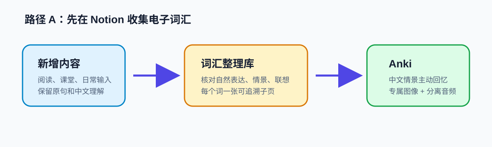
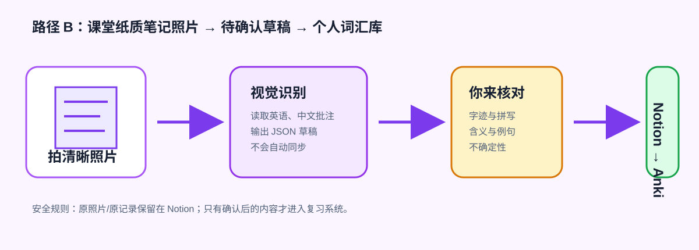

# Windows 图文教程：从零建立你的个人英语词汇库

本教程面向没有现成 Notion 词库的中文学习者。你可以从电子笔记开始，也可以把英语课纸质笔记拍照后再开始。两条路径最后都会回到同一个原则：**保留原记录，先确认，再进入 Anki 复习。**



## 0. 准备好三个东西

1. Windows 10/11 上的 Codex Desktop 或 CLI；
2. 一个可用的 Notion 连接；
3. Anki Desktop。同步 Anki 前还需安装 AnkiConnect 插件（代码 `2055492159`）。

照片识别是可选能力：需要能读取图片的 Codex 会话，或在本机 PowerShell 会话中配置 `OPENAI_API_KEY`。没有它，你仍可以完整使用 Notion → Anki 流程。

## 1. 安装 Skill

在 Codex 中发送：

```text
$skill-installer install from 555K-WDY/notion-anki-vocabulary, path skills/notion-anki-vocabulary
```

安装成功后，重新开始一轮对话并发送：

```text
$notion-anki-vocabulary 初始化我的词汇系统
```

Skill 会先检查你的 Windows 环境；缺少 Notion 页面时创建私人的 `Vocabulary Learning Hub` 和 `词汇整理库`。它不会要求你把 Notion 或 Anki 的密钥写进仓库。

## 路径 A：从 Notion 电子笔记开始

1. 在 `Vocabulary Learning Hub` 的“新增内容”里，随手记录你遇到的英文、原句、中文理解和联想；不必一开始写得完美。
2. 发送：`$notion-anki-vocabulary 检查新增内容并同步到 Anki`。
3. Skill 会先读取最新页面和数据库，再把每个词整理成独立子页。若原句不自然，它会保留原样，同时写出“推测原意、推荐自然表达、修改理由或用法”。
4. 检查词义、中文情景和例句。确认后，Skill 为每个词准备不同的助记图、单词读音、例句读音，并在 Anki 写入成功后才把 Notion 标为“已同步”。

建议你的第一条记录像这样：

```text
原句：I am very devotion to study.
中文理解：我非常投入学习。
发生场景：晚上写雅思作业时。
```

不要自己先追求“标准答案”。这套流程的价值是把你的真实表达保留下来，让后续卡片带着可回忆的个人语境。

## 路径 B：从课堂纸质笔记照片开始



### 1. 拍照和上传

把一页课堂笔记拍成 JPG、PNG 或 WebP。尽量正对纸面、光线均匀、单张小于 10MB。随后任选一种方式：

- 将照片直接上传到 Codex 对话，并说“识别这页英语笔记，生成待确认词汇草稿”；
- 或先将图片拖入 Notion 的“新增内容”区域，再把该 Notion 页面链接发给 Skill；
- 或使用本地脚本识别原图。

若 Notion 连接器无法读取图片内容，Skill 会明确要求原图，不会假装完成识别。

### 2. 使用本地识别脚本（可选）

先在 Windows 的环境变量设置中配置 `OPENAI_API_KEY`，重新打开 PowerShell，然后执行：

```powershell
$SkillRoot = Join-Path $env:USERPROFILE '.codex\skills\notion-anki-vocabulary'
& "$SkillRoot\scripts\recognize-handwriting.ps1" `
  -ImagePath 'D:\EnglishNotes\week-1.jpg' `
  -OutputPath 'D:\EnglishNotes\week-1.draft.json'
```

它会返回 JSON 草稿，而不是自动写入。草稿中每项都带有：`raw_text`、`term`、中文提示、自然释义、建议例句、置信度、`uncertainty` 和 `needs_review: true`。

### 3. 用 60 秒审核草稿

逐项检查：照片中的拼写对不对？缩写还原对不对？中文意思是否贴合课堂上下文？例句是否是你愿意说出口的自然英语？

确认后，把照片保留在 Notion 的“新增内容”或对应词条子页；把确认后的词条录入 `词汇整理库`，再让 Skill 同步到 Anki。看不清的词宁可保留“待确认”，也不要猜测后直接背错。

## 2. 每天怎么维护

- 课堂/阅读中遇到：先记录原句、中文理解和发生场景；
- 每天或每周一次：让 Skill 整理 `新收集`；
- Anki 中：先看中文情景，尝试主动说出英文，再查看答案；
- 若发现卡片不自然：在 Notion 子页补充你的新场景，再同步更新，不要丢掉原记录。

## 3. 常见问题

| 情况 | 怎么做 |
| --- | --- |
| 没有 Notion | 说“初始化我的词汇系统”，Skill 会创建私有学习主页和数据库。 |
| 没有 Anki | 先仅建立 Notion 词库；准备同步时再安装 Anki 与 AnkiConnect。 |
| 识别出的字不确定 | 保留 `uncertainty`，对照原照片核实，不要直接同步。 |
| 不想使用 API | 直接把照片上传至有视觉能力的 Codex 会话，或手动输入 Notion；其余功能照常可用。 |
| 想迁移电脑 | 使用 Skill 的迁移说明；只迁移本地 profile 和媒体，不提交任何个人词库或密钥。 |

下一步：把一条真实的课堂记录放进“新增内容”，然后让 Skill 进行一次只读整理预览。
